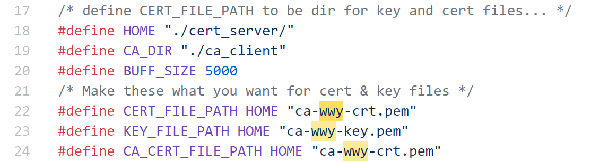

# 运行说明

## 编译

### 修改证书与私钥文件路径

默认证书与私钥文件放在makefile同级文件夹cert_server与ca_client中，需要更改证书与私钥文件的文件名。若文件夹相对路径有更改，则还需更改放置的默认位置。

默认结构为miniVPN:.
							├─ca_client
							└─cert_server
    								└─demoCA
        							├─certs
       							 ├─crl
        							└─newcerts

miniVPNserver.h（服务器）：




miniVPNclient.c（客户端）：


### 修改Makefile文件

```makefile
all: 
	gcc -o miniVPNclient miniVPNclient.c -lssl -lcrypto -lcrypt -lpthread
	gcc -std=gnu11 -o miniVPNserver miniVPNserver.c -lssl -lcrypto -lcrypt -lpthread
	#将编译后的可执行文件拷贝至客户端容器HostU0、HostU1的根目录下，需要修改成自己的容器名
	sudo docker cp ../miniVPN HostU0:/
	sudo docker cp ../miniVPN HostU1:/

clean: 
	rm -f miniVPNclient miniVPNserver 
	rm -f *~
```

在源码文件夹下运行：

```bash
sudo make
```


## 运行

在服务器端运行命令：

```bash
sudo ./miniVPNserver
```

在客户端运行命令：

```bash
#可执行文件名 /etc/hosts中写入的名称 端口号
./miniVPNclient wwy 4433
```

之后根据客户端的提示，输入登录服务器的用户名与密码。


## 显示界面

左为服务器界面，右为客户端界面。

